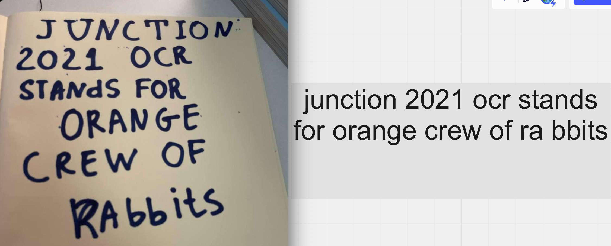
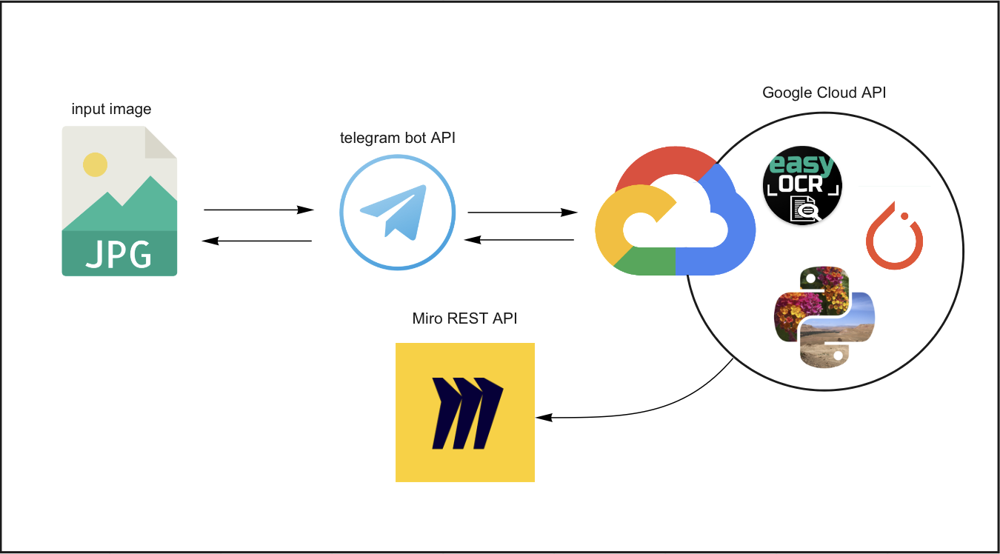

# Junction-2021 Miro case solution 
This project recognizes text from printed/handwritten text photos, converts to plane text and automatically send to Miro whiteboard. Unfortunately, GET picture URL is still not available from Miro REST API, but we found telegram-based solution :)

## How to test
1. Make sure you have a [Telegram account](https://web.telegram.org/k/)
2. Send photo you want to exctract text from to [OCR-bot](http://t.me/miroocrbot). By default your recognized text will appear at common whiteboard. But if you have your own, you can specify it just sent your whiteboard id to that bot
3. Bot will return you recognized text and a link to inserted to Miro whiteboard text-widget

also you separately can check easyocr model: 
## More about pipeline
1. User sends photo to Telegram bot via telegram bot api
2. Telegram bot lives on Google Cloud Platform instance near to easyocr image-to-text recognition model. After telegram bot receives photo, it getting proceed by image-to-text model and returns text. Processing code can be found [here](https://github.com/EdvardOlsen/junction-miro-task-2021/blob/main/Backend/run.py)
3. Text both sending to user with telegram bot api and to Miro whiteboard with Miro REST API

## Demos and videos
1. [First-day draft](https://www.youtube.com/watch?v=zHnxY2oB-Sw)
2. [Telegram bot-demo](http://t.me/miroocrbot)

